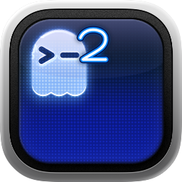

<h1 align="center">
  <br>
  Ghostty²
</h1>

<p align="center">
  Ghostty's speed and native UI with the drop-down workflow and tab ergonomics of iTerm2.
  <br>
  <a href="https://github.com/pihalf/ghostty2/releases">Download</a> ·
  <a href="#features">Features</a> ·
  <a href="#install">Install</a> ·
  <a href="#platform-support">Platform support</a>
</p>

[](https://github.com/pihalf/ghostty2/actions/workflows/ghostty2.yml)

Ghostty² (`ghostty2`) is an independent [Ghostty](https://github.com/ghostty-org/ghostty) fork for people who live in a Quake-style terminal. It keeps Ghostty's fast Zig core, native SwiftUI/GTK interfaces, Metal/OpenGL rendering, splits, and `libghostty`, then makes the hotkey terminal a first-class, tabbed workspace.

## Features

- **Global Quake terminal:** press <kbd>Control</kbd>+<kbd>`</kbd> to show or hide the same drop-down terminal from anywhere. The shortcut is enabled by default and can be changed with normal Ghostty keybind configuration.
- **Tabs inside the quick terminal:** <kbd>Command</kbd>+<kbd>T</kbd> on macOS or <kbd>Control</kbd>+<kbd>Shift</kbd>+<kbd>T</kbd> on Linux creates another live terminal without leaving the drop-down window.
- **Real multi-session behavior:** each tab keeps its own process and split tree while the quick terminal is hidden; tab switching, closing, moving, restoration, and close confirmation use the native platform UI.
- **Ghostty compatibility:** configuration stays in the existing Ghostty location, `TERM` remains `xterm-ghostty`, and internal `libghostty`/protocol identifiers are unchanged.

The result is deliberately small in scope: if iTerm2 and Ghostty had a child, this is the part of the family resemblance we wanted most.

## Install

Install the latest binary release:

```sh
curl -fsSL https://raw.githubusercontent.com/pihalf/ghostty2/main/install.sh | sh
```

On macOS this installs the universal `Ghostty2.app` into `~/Applications`. On Linux it installs the Flatpak bundle for the current CPU architecture. Linux requires [Flatpak](https://flatpak.org/setup/) and a configured Flathub remote.

You can also download the macOS ZIP or Linux Flatpak directly from [Releases](https://github.com/pihalf/ghostty2/releases).

Nix users can install the package from source with:

```sh
nix profile install github:pihalf/ghostty2#ghostty2
```

## Build from source

Ghostty² uses Ghostty's build system and Zig 0.15.2:

```sh
git clone https://github.com/pihalf/ghostty2.git
cd ghostty2
zig build -Doptimize=ReleaseFast
```

The result is `zig-out/bin/ghostty2` on Linux and `zig-out/Ghostty2.app` on macOS. Linux needs the GTK/libadwaita/layer-shell development packages; macOS needs full Xcode with the macOS, iOS, and Metal components. The Nix development shell provides the remaining build dependencies.

## Platform support

| Platform | App | Quake terminal | Global shortcut | Quick-terminal tabs |
| --- | --- | --- | --- | --- |
| macOS 13+ | Native SwiftUI/Metal | Yes | Native global key monitor | <kbd>Command</kbd>+<kbd>T</kbd> |
| Linux Wayland | Native GTK/OpenGL | On supported compositors | XDG GlobalShortcuts portal or compositor binding | <kbd>Control</kbd>+<kbd>Shift</kbd>+<kbd>T</kbd> |
| Linux X11 | Native GTK/OpenGL | Not currently supported | Compositor/window-manager binding only | Normal window tabs work |

On Linux, the drop-down placement requires a compositor with the layer-shell protocol. KDE Plasma Wayland and wlroots-based compositors are the intended targets. GNOME's compositor and X11 do not provide the required layer-shell behavior. If your desktop does not expose the global-shortcut portal, bind this command in the compositor instead:

```sh
ghostty2 +toggle-quick-terminal
```

For the Flatpak build, use `flatpak run io.github.pihalf.ghostty2 +toggle-quick-terminal`.

## Crash reports and updates

Ghostty² does not include a crash-capture SDK or bundled updater. “Check for Updates…” opens this fork's Releases page on demand. The retained `auto-update` configuration names are inert compatibility keys so existing Ghostty configurations continue to parse.

## Development

```sh
zig build test
zig fmt --check .
```

The public CI additionally runs the Swift/macOS test suite, Linux core tests, GTK Wayland and X11 builds, dependency/icon checks, and distributable macOS and Flatpak builds.

See [HACKING.md](HACKING.md) for the upstream development environment and architecture notes.

## Credits and license

Ghostty² is based on [Ghostty](https://github.com/ghostty-org/ghostty) and remains MIT licensed; the original Ghostty authors and contributors did the overwhelming majority of the work. The interaction model is inspired by [iTerm2](https://github.com/gnachman/iTerm2), but no iTerm2 source code is incorporated. Ghostty² is not affiliated with either project.

See [LICENSE](LICENSE) for license terms.
